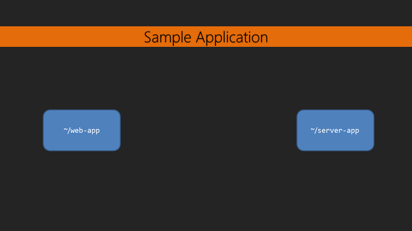

# Mastering TypeScript - Slice-it Pizza Sample Application



Slice-it Pizza is a simple food order management system.

It allows the user to input food items and orders containing specific food items.

## Recommended Text Editor

This code is designed to be used with [Visual Studio Code](https://code.visualstudio.com/). It's free and runs on Windows, OS X, and Linux.

Individually open up the `web-app` folder and `server-app` folder.

## System Setup

1. Download and install [Node.js](https://nodejs.org/en/).
2. Ensure gulp is installed: `npm install -g gulp`

## Setup

In the `server-app` run:

```bash
~/server-app> npm install
~/server-app> gulp
~/server-app> npm start
```

Then in the `web-app` run:

```bash
~/web-app> npm install
~/web-app> gulp
~/web-app> npm start
```

* `npm install` - Installs the application dependencies
* `gulp` - Builds the application
* `npm start` - Starts the application

Make sure to start the `server-app` before running the `web-app`. Otherwise the `web-app` will have nothing to connect to.

## server-app

Listens for requests to list/insert/update/remove food items and orders from a database.

See `~/server-app/readme.md` for more details.

## web-app

Interacts with the server-app to list/insert/update/remove food items and orders.

The user is displayed information and they can view/add/update/remove food items and orders.

See `~/web-app/readme.md` for more details.
